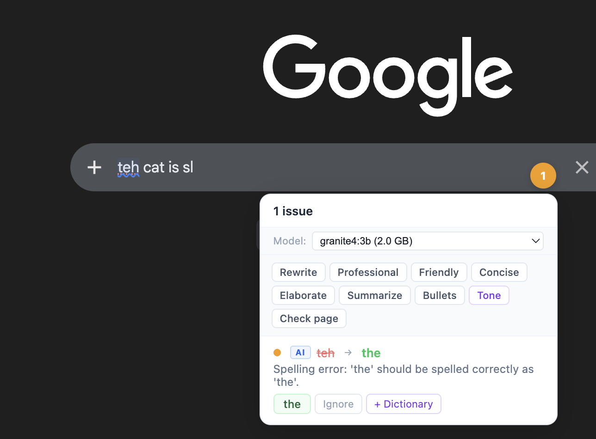
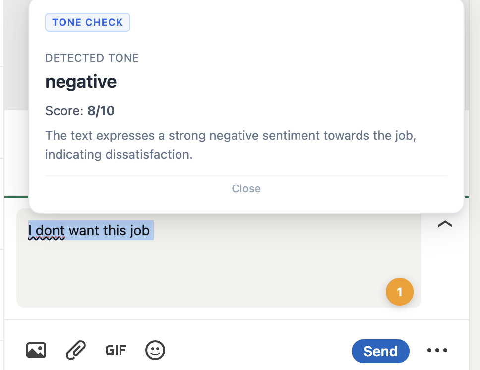
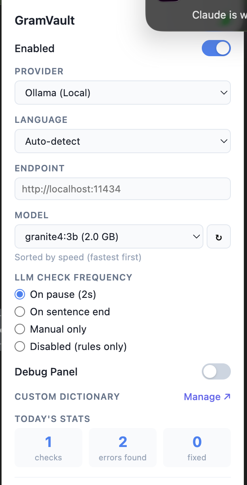
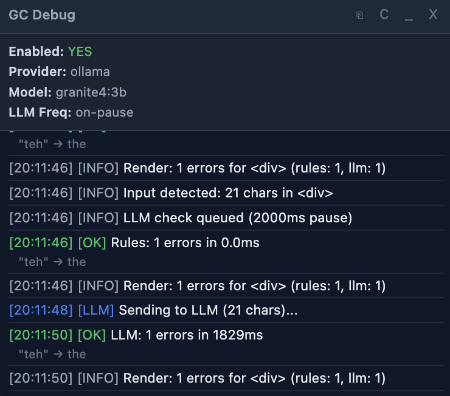

<p align="center">
  
</p>

<h1 align="center">GramVault</h1>

<p align="center">
  Chrome extension for real-time grammar checking powered by local or cloud LLMs.<br>
  Works like Grammarly but your text stays private — locked in your vault.
</p>

## Screenshots

<table>
  <tr>
    <td align="center"><br><sub>Badge panel — inline diff with one-click fix</sub></td>
    <td align="center"><br><sub>Tone check — detected tone with score</sub></td>
  </tr>
  <tr>
    <td align="center"><br><sub>Settings — provider, model, LLM frequency</sub></td>
    <td align="center"><br><sub>Debug panel — real-time check log</sub></td>
  </tr>
</table>

## Features

- **Two-tier checking**: Instant rule-based checks (150ms) + LLM deep analysis (configurable)
- **Floating badge**: Grammarly-style error count badge on every text field — click to fix
- **Diff view**: Each error shows original ~~struck through~~ → suggested fix inline
- **Severity levels**: Critical / Warning / Suggestion — color-coded dots per issue
- **Quick actions**: Rewrite, Professional, Friendly, Concise, Elaborate, Summarize, Bullets, Tone Check — all from the badge panel
- **Model switcher**: Change model directly from the badge panel without opening settings
- **Batch check**: "Check page" scans all text fields on the current page at once
- **Right-click menu**: Select text and use GramVault context menu for any action
- **Fix all**: One-click to apply all grammar fixes at once
- **Tone check**: Detects tone with score bar and rewrite suggestions
- **Custom dictionary**: Add words to skip (technical terms, names, acronyms)
- **Multi-language**: English, Spanish, French, German, Portuguese, Italian, Dutch, Japanese, Chinese
- **Writing stats**: Daily check count, errors found, and fixes applied
- **Keyboard shortcut**: `Ctrl+Shift+G` (Mac: `MacCtrl+Shift+G`) opens the badge panel
- **Multi-provider**: Ollama, LM Studio, OpenAI, Anthropic, Gemini, OpenRouter
- **Local first**: Prioritizes local providers — text never leaves your device
- **iframe support**: Works in Gmail compose, Outlook web, and embedded editors
- **Debug panel**: Floating log panel for troubleshooting (toggle in settings)

## Setup

### 1. Install the extension

1. Open `chrome://extensions`
2. Enable **Developer mode** (top right)
3. Click **Load unpacked** and select this folder

### 2. Set up a local LLM (recommended)

**Ollama:**
```bash
# Install from https://ollama.com
ollama pull gemma3:1b    # Fast, good for grammar
ollama serve

# Allow Chrome extension access
launchctl setenv OLLAMA_ORIGINS '*'
# Then restart Ollama
```

**LM Studio:**
1. Download from https://lmstudio.ai
2. Load any model
3. Enable the local server (localhost:1234)

### 3. Configure

Click the extension icon to open settings:
- **Provider**: Choose Ollama, LM Studio, or a cloud provider
- **Language**: Set your writing language (default: Auto-detect)
- **Model**: Auto-detected from your provider, small models recommended
- **LLM Frequency**: How often the LLM runs (on pause, on sentence end, manual, or disabled)
- **API Key**: Required for cloud providers only
- **Custom Dictionary**: Add words to ignore (technical terms, names, etc.)

## Usage

### Automatic checking
Type in any text field — rule-based errors appear instantly (red outline), LLM errors follow based on your frequency setting.

### Badge panel
Click the floating badge (bottom-right of text fields) to:
- See all errors with diff view (~~original~~ → fix) and severity dots
- Switch model without opening popup
- Run quick actions (Rewrite, Professional, Tone, etc.)
- Batch-check all fields on the page
- Fix all issues at once

### Keyboard shortcut
`Ctrl+Shift+G` (Mac: `MacCtrl+Shift+G`) opens the badge panel for the focused field.

### Right-click menu
Select text, right-click > **GramVault** for:
- Check Grammar (with auto-correct)
- Rewrite / Make Professional / Make Friendly / Make Concise
- Elaborate / Summarize / Convert to Bullets / Reformat
- Tone Check

## Recommended models (by speed on Apple Silicon)

| Model | Size | Notes |
|---|---|---|
| gemma3:1b | 1B | Fastest, good for basic grammar |
| llama3.2:3b | 3B | Solid balance |
| qwen3:1.7b | 1.7B | Good small model |
| phi4-mini | 3.8B | Strong reasoning |
| gemma3:4b | 4B | Good quality |
| qwen3:8b | 8B | Best quality under 8B |

## Rule-based checks (no LLM needed)

These run instantly with zero latency:
- Double words ("the the")
- A/an misuse ("a apple")
- Common misspellings (~200 words)
- Missing capitalization after periods
- Double spaces
- Missing space after punctuation
- Subject-verb agreement (simple cases)
- Unclosed quotes
- Common confusions (its/it's)
- Homophones (then/than)
- Gender-neutral language suggestions
- Run-on sentence detection

## Files

```
manifest.json    — Chrome extension config (Manifest V3)
background.js    — Service worker: multi-provider API, context menus
content.js       — Content script: detection, badge, overlays, popups
content.css      — All visual styling
rules.js         — Fast rule-based grammar checker
popup.html/js/css — Settings UI
icons/           — Extension icons
```
